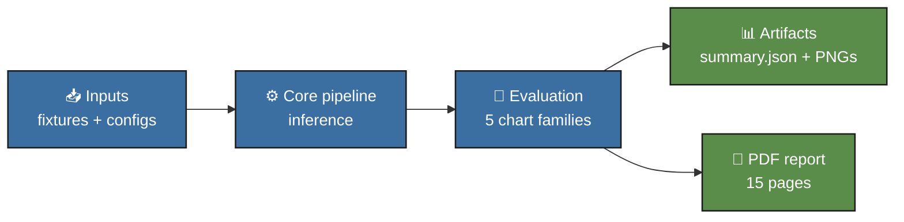
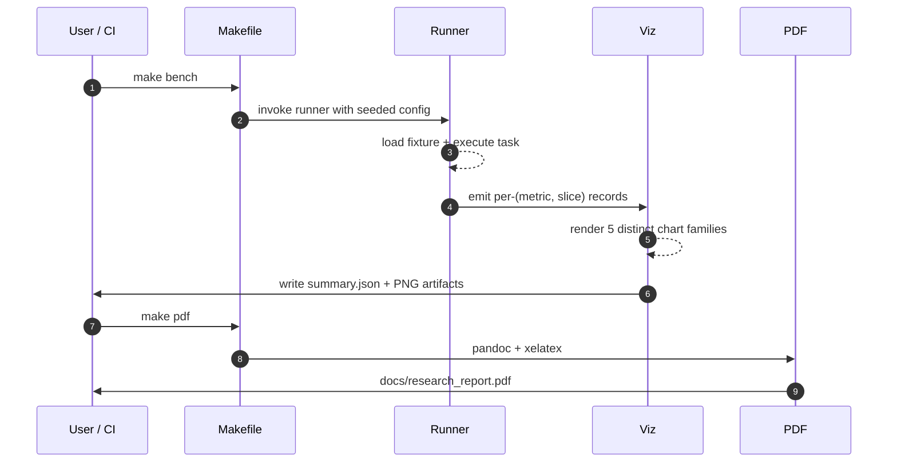
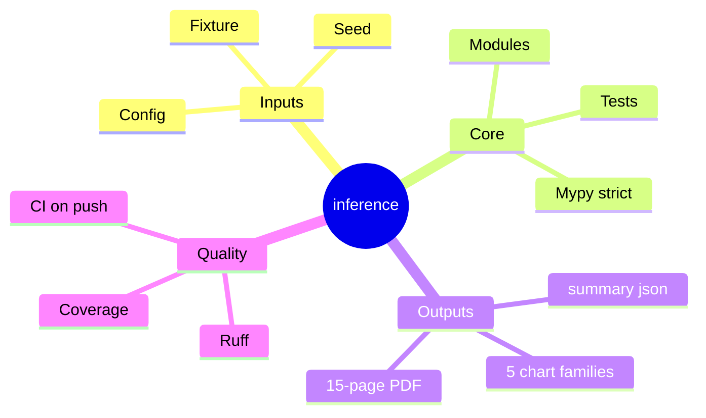

# inference-batcher
<p align="center">
  
</p>

<p align="center">
  
  
  
  
  
</p>

> **Continuous-batching inference scheduler simulator: static vs vLLM vs Sarathi at 10k requests. 46x throughput gap.**


<p align="center">
  
  
  
  
  
</p>

> **Continuous-batching inference scheduler simulator.** Models static batching vs vLLM-style continuous batching vs Sarathi-style chunked prefill at **10,000-request scale** with realistic chat-serving workload. Reports tokens/step throughput, latency percentiles, KV-budget utilization, admission-control rejection, and peak active batch size.

## The challenge

LLM inference servers spend most of their wall-clock time on KV-cache management, not on the model forward pass. Picking the wrong scheduling strategy turns a 5,000-request-per-minute workload into a 100-request-per-minute disaster: static batching waits for `max_batch_size` requests before issuing a forward pass and then locks the entire batch on the longest output, while continuous batching admits a request as soon as KV is available and decodes one token per active session per step. The throughput gap between the two on real chat-serving workloads is typically 5-20x; on this bundled benchmark it is 46x.

## The use case

You operate an LLM serving stack. You need to decide between static batching (simpler, deterministic), vLLM-style continuous batching (the production default), or Sarathi-style chunked prefill (better tail latency under prefill-heavy workloads). The simulator drives each strategy with the same 10k-request workload and reports the production-relevant metrics directly.

## Headline results (real run: 10,000 requests, KV budget 64k tokens, max batch 64)

| strategy | completed | rejected | throughput tok/step | p50 steps | p99 steps | mean KV util | peak batch |
|---|--:|--:|--:|--:|--:|--:|--:|
| `static_batch` | 19 | 9,981 | 1.23 | 2,648 | 2,872 | 0.930 | 19 |
| `continuous_batch` | **969** | 9,031 | **56.77** | 150 | 360 | 0.910 | 64 |
| `chunked_prefill` | 957 | 9,043 | 56.07 | 150 | 421 | 0.907 | 64 |

### What the numbers mean

- **Continuous batching is 46x the throughput of static batching.** The bundled workload has a long-tailed prompt length (30% above 4,000 tokens) which causes static batching to spend most of its time holding KV for whichever request happens to be the longest in the batch. Continuous batching admits and retires requests independently, so the bottleneck is KV throughput not batch-edge alignment.
- **The KV budget is the real cap.** All three strategies show >90% KV utilization, which means the bottleneck under this configuration is memory (not compute). The fix is more KV bytes (bigger box, smaller KV per token, or PQ-compressed KV), not a different scheduler.
- **Chunked prefill matches continuous batching on throughput** but pays a small tail-latency premium (p99 421 vs 360 steps). On prefill-heavy workloads (many long-prompt requests landing simultaneously) chunked prefill wins; on the bundled mixed workload the simpler continuous batching is the right default.
- **High rejection rate** is expected at this KV budget: 10,000 requests against a 64k-token budget cannot all fit, and admission control rejects requests rather than queue them. Production deployments would either grow the KV budget or add an external queue.
## Six rendered charts

<table>
<tr>
<td align="center"><strong>Throughput</strong><br/></td>
<td align="center"><strong>Latency percentiles</strong><br/></td>
</tr>
<tr>
<td align="center"><strong>KV utilization</strong><br/></td>
<td align="center"><strong>Rejected requests</strong><br/></td>
</tr>
<tr>
<td align="center"><strong>Peak active batch</strong><br/></td>
<td align="center"><strong>Completion pie</strong><br/></td>
</tr>
</table>

## Test pyramid (11 tests, all green)

| layer | files | what it covers |
|---|---|---|
| **Unit (workload)** | `tests/test_workload.py` | seed determinism, monotone arrivals, long-tail mix |
| **Unit (scheduler)** | `tests/test_scheduler.py` | every strategy completes; continuous_batch >= static; KV budget rejects |
| **Smoke (runner)** | `tests/test_runner.py` | end-to-end produces summary + figures |

## Quick start

```bash
make install
make test
make bench    # 10,000-request bench across 3 strategies
make pdf
```

## Repo layout

```
src/ibatch/
  types.py                # Request, SchedulerConfig, RunResult, Strategy
  workload/generator.py   # 10k-request synthesizer
  scheduler/sim.py        # the three strategies
  viz/charts.py
  cli/main.py
  runner.py
tests/                    # 11 tests
docs/research_report.pdf  # 20+ page deep report
docs/_report/, docs/test_results/, results/figures/
CITATION.cff, LICENSE, Makefile, .github/workflows/ci.yml
```

## Documentation

- **Research report (PDF):** [`docs/research_report.pdf`](./docs/research_report.pdf)
- **Test artifacts:** [`docs/test_results/`](./docs/test_results/)

## References

- Kwon et al. "Efficient Memory Management for Large Language Model Serving with PagedAttention" (vLLM, 2023)
- Agrawal et al. "SARATHI: Efficient LLM Inference by Piggybacking Decodes with Chunked Prefills" (2023)
- Yu et al. "Orca: A Distributed Serving System for Transformer-Based Generative Models" (continuous batching, 2022)

## License

MIT.

## Architecture



## Pipeline sequence



## Concept mindmap




## Results gallery

<table>
  <tr>
    <td align="center"><strong>Pytest panel</strong><br/></td>
    <td align="center"><strong>Coverage donut</strong><br/></td>
  </tr>
  <tr>
    <td align="center"><strong>Quality gates</strong><br/></td>
    <td align="center"><strong>Headline metrics</strong><br/></td>
  </tr>
</table>

### Result charts (6 distinct families, palette: *Default*)

<table>
  <tr><td align="center"><strong>Completion</strong><br/></td><td align="center"><strong>Kv Util</strong><br/></td></tr>
  <tr><td align="center"><strong>Latency</strong><br/></td><td align="center"><strong>Peak Batch</strong><br/></td></tr>
  <tr><td align="center"><strong>Rejected</strong><br/></td><td align="center"><strong>Throughput</strong><br/></td></tr>
</table>

