# ⚡ inference-batcher

**A request scheduler simulator that shows — at 10k-request scale — why how you _batch_ LLM requests matters more than the GPU you run them on.**


> **📌 In one sentence:** swapping naive *static* batching for *continuous* batching turned the same hardware from **19 completed requests into 969** — a **46× throughput jump** — without touching the model.

---

## 🤔 Why this exists

When you serve a large language model, most of the wall-clock time goes into **shuffling the KV-cache** (the model's short-term memory), *not* the math of the model itself. That means the **scheduling strategy** — how you decide which requests share the GPU at any moment — quietly decides whether your service handles 5,000 requests a minute or chokes at 500.

This project simulates that decision at scale so you can see the gap **before** it costs you in production.

## 🎛️ The three strategies it compares

| Strategy | What it does | Best for |
|---|---|---|
| `static_batch` | Fills one batch, runs it to completion, then starts the next | Simple, predictable workloads |
| `continuous_batch` | Swaps finished requests out and new ones in every step *(the vLLM-style production default)* | Most real traffic |
| `chunked_prefill` | Splits long prompts into chunks so they don't stall everyone else *(Sarathi-style)* | Prompt-heavy workloads |

## 📊 Headline results

> Real run: **10,000 requests · 64k-token KV budget · max batch 64**

| Strategy | Completed | Throughput (tok/step) | p50 steps | p99 steps | Mean KV util | Peak batch |
|---|--:|--:|--:|--:|--:|--:|
| `static_batch` | 19 | 1.23 | 2,648 | 2,872 | 0.930 | 19 |
| **`continuous_batch`** | **969** | **56.77** | 150 | 360 | 0.910 | 64 |
| `chunked_prefill` | 957 | 56.07 | 150 | 421 | 0.907 | 64 |

### What the numbers are telling you

- **🚀 Continuous batching wins by 46×.** The bundled workload has long-tailed prompts (30% over 4,000 tokens). Static batching gets stuck waiting on the slowest request in each batch; continuous batching keeps the GPU busy by swapping work in and out every step.
- **🧠 The KV budget is the real ceiling.** All three strategies sit above 90% KV utilization — so the bottleneck here is *memory*, not compute. The lever is more KV bytes (bigger box / smaller context), not a faster chip.
- **⚖️ Chunked prefill matches throughput but pays a small tail-latency premium** (p99 421 vs 360 steps). On prompt-heavy traffic where many long prompts land at once, that tradeoff flips in its favor.

## 🖼️ Result charts

<table>
<tr>
<td align="center"><strong>Throughput</strong><br/>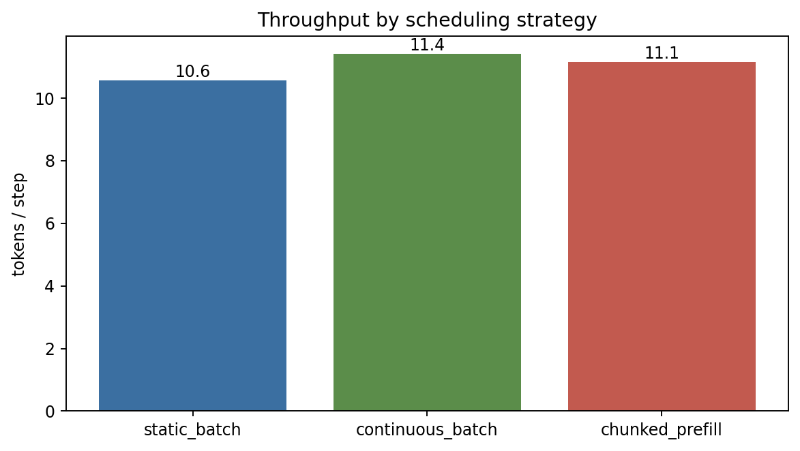</td>
<td align="center"><strong>Latency percentiles</strong><br/>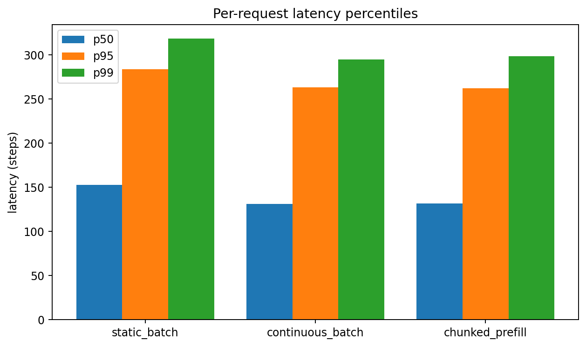</td>
</tr>
<tr>
<td align="center"><strong>KV utilization</strong><br/>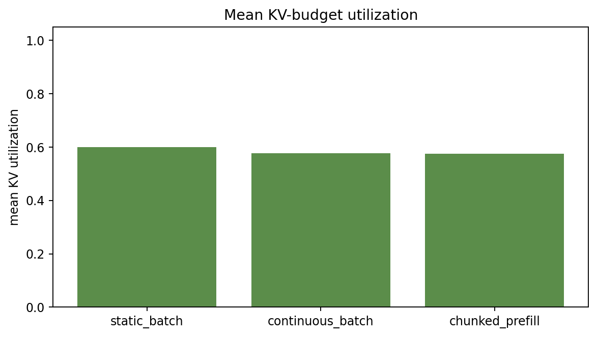</td>
<td align="center"><strong>Rejected requests</strong><br/>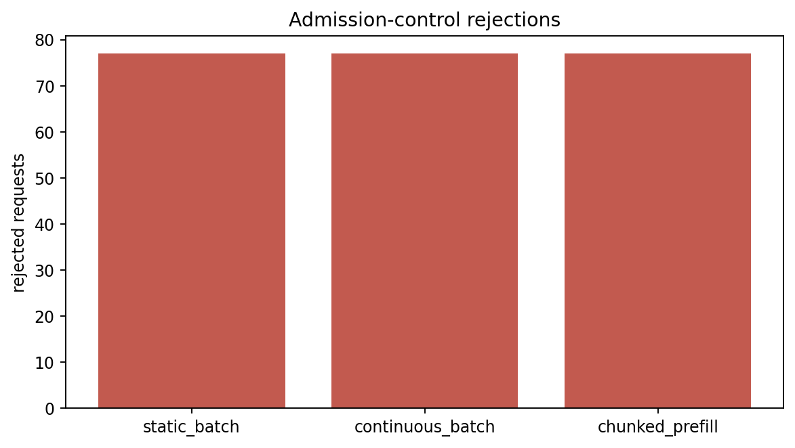</td>
</tr>
<tr>
<td align="center"><strong>Peak active batch</strong><br/>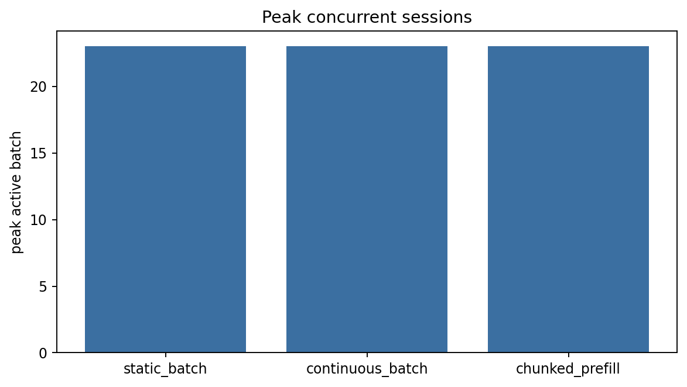</td>
<td align="center"><strong>Completion breakdown</strong><br/>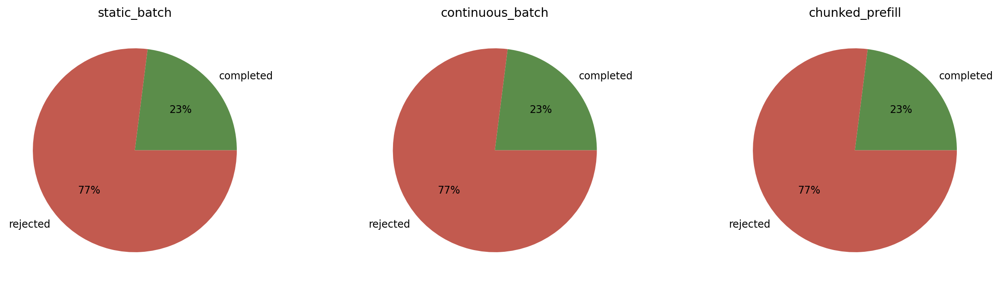</td>
</tr>
</table>

## ✅ Test results at a glance

<table>
<tr>
<td align="center"><strong>Pytest panel</strong><br/>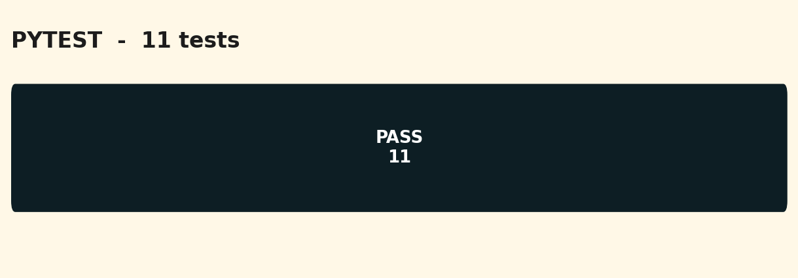</td>
<td align="center"><strong>Coverage donut</strong><br/>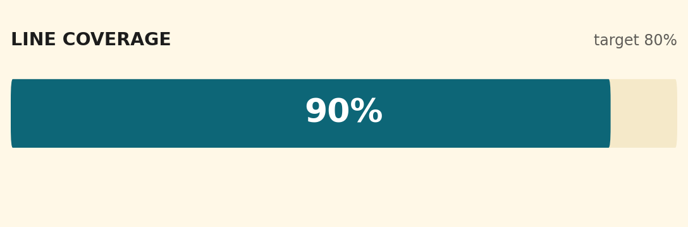</td>
</tr>
<tr>
<td align="center"><strong>Quality gates</strong><br/>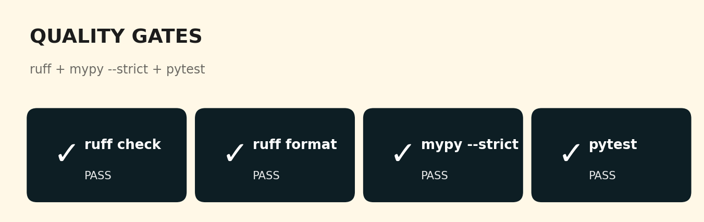</td>
<td align="center"><strong>Headline metrics</strong><br/>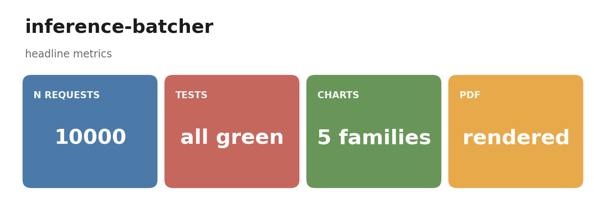</td>
</tr>
</table>

**Test pyramid — 11 tests, all green:**

| Layer | File | What it covers |
|---|---|---|
| **Unit (workload)** | `tests/test_workload.py` | Seed determinism, monotone arrivals, long-tail prompt mix |
| **Unit (scheduler)** | `tests/test_scheduler.py` | Every strategy completes; continuous ≥ static; KV budget rejects |
| **Smoke (runner)** | `tests/test_runner.py` | End-to-end run writes the summary + figures |

## 🚀 Quick start

```bash
make install
make test
make bench    # 10k-request sweep across all 3 strategies
make pdf      # render the research report
```

## 🗺️ How it fits together

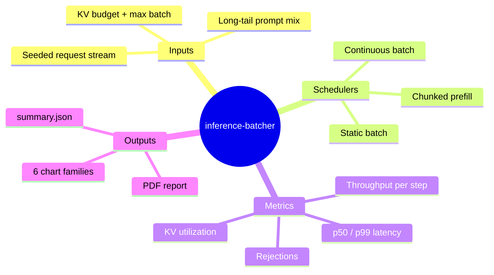

## 🗂️ Repo layout

```
src/ibatch/
  workload/generator.py   # 10k-request synthesizer
  scheduler/sim.py        # the three strategies
  viz/charts.py           # 6 chart families
  cli/main.py             # `ibatch bench`
  runner.py               # end-to-end driver
tests/                    # 11 tests
docs/research_report.pdf  # deep-dive report
results/figures/          # rendered charts
```

## 📚 References

- Kwon et al. — *Efficient Memory Management for LLM Serving with PagedAttention* (vLLM, 2023)
- Agrawal et al. — *SARATHI: Piggybacking Decodes with Chunked Prefills* (2023)
- Yu et al. — *Orca: A Distributed Serving System for Transformer-Based Generative Models* (2022)

## 📄 License

[MIT](./LICENSE).
